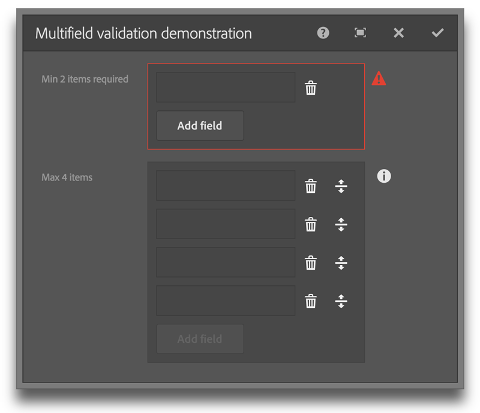

# AEM Touch UI Validation Library

This project provides enhanced validation and functionality for Adobe Experience Manager 6 Granite dialogs.

The project uses all out-of-the-box components and clientlibs without overlays. This library is a simple clientlib that you can add or remove without affecting the rest of your project. The clientlib is in the `cq.authoring.dialog` category making it immediately available in authoring mode.

## Goals

* Add enhanced validation while behaving in a completely unobtrusive manner.
* Provide validation in a consistent style as out-of-the-box validation using the familiar red notification icon; no alerts, modals or prompts.

## Added functionality

The following documents the added functionality which does not include the provided
AEM validation. See the documentation at [https://docs.adobe.com/docs/en/aem/6-1/ref/granite-ui/api/jcr_root/libs/granite/ui/components/foundation/index.html](https://docs.adobe.com/docs/en/aem/6-1/ref/granite-ui/api/jcr_root/libs/granite/ui/components/foundation/index.html).

### multifield

**min**  
*type:* {Long}  
*description:* The minimum number of multifield items  
*default:* Not active

**max**  
*type:* {Long}  
*description:* Limits the maximum number of multifield items as opposed to validating.  
*default:* Not active

### pathbrowser

**required**  
*type:* {Boolean}  
*description:* Makes the field required  
*default:* false

**allowNonRootPath**  
*type:* {Boolean}  
*description:* Allows a path that is not bound by the root path  
*default:* false

**allowNonExistingPath**  
*type:* {Boolean}  
*description:* Allows a path that is not a node in the JCR  
*default:* false

**Note:**  
Use *allowNonRootPath* in conjunction with *allowNonExistingPath* to allow the
user the option of selecting a page within AEM or typing in an external URL.

### textfield / textarea / password

**minlength**  
*type:* {Long}  
*Description:* Minimum number of characters allowed  
*default:* Not active

**activeValidation**  
*type:* {Boolean}  
*Description:* Validation updates as the user types instead of waiting until the field loses focus.  
*default:* false

**pattern**  
*type:* {Regex|String}  
*Description:* A named regular expression pattern or a regular expression (e.g. `^\\d+$`).  
*default:* Not active

**Named regex patterns:**  
*phone*, *email*, *url*, *number*, *dateISO*, *alpha*, *alphaNumberic*, *integer*, *systemKey*

### colorpicker

**required**  
*type:* {Boolean}  
*description:* Makes the field required  
*default:* false

### autocomplete / userpicker

**required**  
*type:* {Boolean}  
*description:* Makes the field required  
*default:* false

### radiogroup

**required**  
*type:* {Boolean}  
*description:* Makes the field required  
*default:* false

## Requirements

This project was built and tested with AEM 6.1.

## How to build the Demo

If you have a running AEM instance you can build and package the whole project and deploy into AEM from within the /src folder with: 

    mvn clean install -PautoInstallPackage

## Explore the demo

1. Navigate to [http://localhost:4502/editor.html/content/aem-touch-ui-validation/en.html](http://localhost:4502/editor.html/content/aem-touch-ui-validation/en.html)
2. Open the component dialogs and test the various included Touch UI components.

The main parts of the source project are:

* ui.apps: contains the /apps and /etc parts of the project, ie JS & CSS clientlibs, components and templates. The validation library is under /etc/designs/aem-touch-ui-validation
* ui.content: contains sample content using the components from the ui.apps. 

## Using the library

A package is provided in the /package folder. Install it with Package Manager at [http://localhost:4502/crx/packmgr/index.jsp](http://localhost:4502/crx/packmgr/index.jsp) or you can copy the /aem-touch-ui-validation folder into your project.

The project is licensed under Apache License 2.0.
